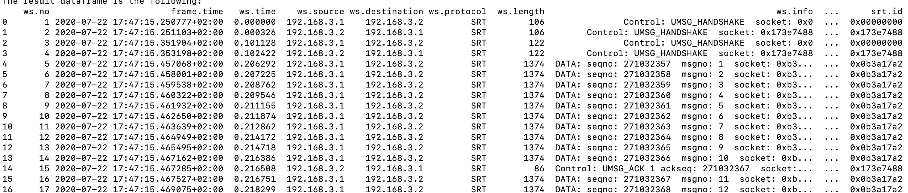

# lib-tcpdump-processing

**`lib-tcpdump-processing`** is a library designed to process `.pcap(ng)` [tcpdump](https://www.tcpdump.org/) or [Wireshark](https://www.wireshark.org/) trace files and extract [SRT](https://github.com/Haivision/srt) packets of interest for further analysis.

It also helps to process a network trace file and generate a report with SRT related statistics, in particular,
- The number of SRT DATA and CONTROL packets present in a dump,
- Original DATA packets received, lost, recovered, and unrecovered,
- Retransmitted DATA packets received and the number of packets retransmitted once, twice, 3x or more times,
- The information about CONTROL packets (ACK, ACKACK, and NAK packets),
- And other important information.

See [`get-traffic-stats`](#get-traffic-stats) script for details and report example.

**Important:** Currently, trace files containing only one flow of data are supported. To support several data flows adjustments will be required.

**Known Issue:** There is a known [CEST/CST datetime processing issue](https://github.com/mbakholdina/lib-tcpdump-processing/issues/22) which is going to be addressed soon. Until then please apply the changes from [PR #25](https://github.com/mbakholdina/lib-tcpdump-processing/pull/25) to address the issue.

## Getting Started

### Requirements

* python 3.6+
* tshark 3.2.2+ (setting up tshark is described [here](https://github.com/mbakholdina/srt-test-runner#setting-up-tshark) and in the SRT CookBook [here](https://srtlab.github.io/srt-cookbook/how-to-articles/how-to-setup-wireshark-for-srt-traffic-analysis/))

### Install the library with pip

For development, it is recommended to:
* use `venv` for virtual environments and `pip` for installing the library and any dependencies. This ensures the code and dependencies are isolated from the system Python installation,
* install the library in “editable” mode by running `pip install -e .` from the same directory. This allows changing the source code (both tests and library) and rerunning tests against library code at will. For regular installation, use `pip install .`.

As soon as the library is installed, you can run modules directly:
```
venv/bin/python -m tcpdump_processing.extract_packets --help
```

or use preinstalled executable scripts:
```
venv/bin/extract-packets --help
```

### Install the library to import in another project

Install with `pip` (a `venv` is recommended), using the `pip` VCS requirement specifier:
```
pip install 'git+https://github.com/mbakholdina/lib-tcpdump-processing.git@v0.1#egg=tcpdump_processing'
```

or simply put the following row in `requirements.txt`:
```
git+https://github.com/mbakholdina/lib-tcpdump-processing.git@v0.1#egg=tcpdump_processing
```

Remember to quote the full URL to avoid shell expansion in the case of direct installation.

This installs the version corresponding to the git tag 'v0.1'. You can replace that with a branch name, a commit hash, or a git ref as necessary. See the [pip documentation](https://pip.pypa.io/en/stable/reference/pip_install/#vcs-support) for details.

To install the latest master, use:
```
git+https://github.com/mbakholdina/lib-tcpdump-processing.git@master#egg=tcpdump_processing
```

As soon as the library is installed, you can import the whole library:
```
import tcpdump_processing
```

or a particular module:
```
import tcpdump_processing.extract_packets as extract_packets
```

## Executable Scripts

To use the following scripts, please install the library first (see the [Install the library with pip](#install-the-library-with-pip) section).

### `extract-packets`

This script parses `.pcap(ng)` trace file, saves the output in `.csv` format in the same directory as the original file, extracts packets of interest, and saves the obtained dataframe in `.csv` format in the same directory as the original file.

Usage:
```
venv/bin/extract-packets [OPTIONS] PATH
```
where `PATH` refers to `.pcap(ng)` file.

Options:
```
Options:
  --type [srt|data|control|probing|umsg_handshake|umsg_ack]
                                  Packet type to extract: SRT (both DATA and
                                  CONTROL), SRT DATA, SRT CONTROL, SRT DATA
                                  probing, SRT CONTROL UMSG_HANDSHAKE, or SRT
                                  CONTROL UMSG_ACK packets.  [default:
                                  probing]

  --overwrite / --no-overwrite    If exists, overwrite the .csv file produced
                                  out of the .pcapng (or .pcap) tcpdump trace
                                  one at the previous iterations of running
                                  the script.  [default: False]

  --save / --no-save              Save dataframe with extracted packets into
                                  .csv file.  [default: False]

  --help                          Show this message and exit.
```

Here is an example of the report generated when extracting `--type srt` packets:



### `get-traffic-stats`

This script parses a network trace file and prints SRT-related traffic statistics, in particular the SRT protocol overhead in the transmission. Intermediate data is stored in  `.csv` format in the same directory as the original file.

Usage: 
```
venv/bin/get-traffic-stats [OPTIONS] PATH
```
where `PATH` refers to `.pcap` or `.pcapng` tcpdump trace file.

Options:
```
Options:
  --overwrite / --no-overwrite  If exists, overwrite the .csv file produced
                                out of the .pcap (or .pcapng) tcpdump trace
                                one at the previous iterations of running the
                                script.  [default: False]

  --help                        Show this message and exit.
```

Here is an example of the report generated:


## Data Preparation

A `.pcap(ng)` trace file with measurements from a specific network interface and port collected at the receiver side is used as a proxy for packet data collected by SRT. This trace file is preprocessed in `.csv` format with timestamp, source IP address, destination IP address, protocol, and other columns and rows representing observations (received packets).

This data is further cleaned and transformed using [pandas](https://pandas.pydata.org/) in the following way:
1. The data is filtered to extract SRT packets only (`ws.protocol == SRT`), which makes sense for further analysis.
2. The dataset then is split into DATA (`srt.iscontrol == 0`) and CONTROL (`srt.iscontrol == 1`) packets.
3. For DATA packets, timestamps are converted from seconds to microseconds using the same procedure as in the protocol. To be precise, the new variable `ws.time.us` is obtained as `(ws.time * 1000000).astype('int64')`.
4. For DATA packets, the inter-arrival time is calculated as the difference between current and previous packet timestamps and stored as a separate variable `ws.iat.us`. Please note that the time delta for the first SRT data packet by default is equal to 0. That's why this packet should probably be excluded from the analysis.
5. Type conversion is performed to structure the data in appropriate formats.

The detailed description of dataset variables, tcpdump/Wireshark dissectors and other data is provided in the table below. See columns `DATA` and `CONTROL` to determine whether a variable is present (`✓`) or absent (`-`) in a corresponding dataset.

| Dataset Variable  | Wireshark Dissector    | Description                                                              | DATA       | CONTROL   | Data Type  |
|:------------------|:-----------------------|:-------------------------------------------------------------------------|:-----------|:----------|:-----------|
| ws.no             | _ws.col.No.            | Number as registered by Wireshark                                        | ✓          | ✓         | int64      |
| frame.time        | frame.time             | Absolute time when the frame was captured as registered by Wireshark     | ✓          | ✓         | datetime64 |
| ws.time           | _ws.col.Time           | Relative timestamp as registered by Wireshark (seconds)                  | ✓          | ✓         | float64    |
| ws.source         | _ws.col.Source         | Source IP address                                                        | ✓          | ✓         | category   |
| ws.destination    | _ws.col.Destination    | Destination IP address                                                   | ✓          | ✓         | category   |
| ws.protocol       | _ws.col.Protocol       | Protocol                                                                 | ✓          | ✓         | category   |
| ws.length         | _ws.col.Length         | Length (bytes)                                                           | ✓          | ✓         | int16      |
| ws.info           | _ws.col.Info           | Information                                                              | ✓          | ✓         | object     |
| udp.length        | udp.length             | UDP packet size (bytes)                                                  | ✓          | ✓         | int16      |
| srt.iscontrol     | srt.iscontrol          | Content type (CONTROL if 1, DATA if 0)                                   | ✓          | ✓         | int8       |
| srt.type          | srt.type               | Message type (e.g. UMSG_ACK, UMSG_ACKACK)                                | -          | ✓         | category   |
| srt.seqno         | srt.seqno              | Sequence number                                                          | ✓          | -         | int64      |
| srt.msg.rexmit    | srt.msg.rexmit         | Sent as original if 0, retransmitted if 1                                | ✓          | -         | int8       |
| srt.timestamp     | srt.timestamp          | Timestamp since the socket was opened (microseconds)                     | ✓          | ✓         | int64      |
| srt.id            | srt.id                 | Destination socket id                                                    | ✓          | ✓         | category   |
| srt.ack_seqno     | srt.ack_seqno          | First unacknowledged sequence number                                     | -          | ✓         | int64      |
| srt.rtt           | srt.rtt                | Round Trip Time (RTT) estimate (microseconds)                          | -          | ✓         | int64      |
| srt.rttvar        | srt.rttvar             | The variance of Round Trip Time (RTT) estimate (microseconds)          | -          | ✓         | int64      |
| srt.rate          | srt.rate               | Receiving speed estimate (packets/s)                                   | -          | ✓         | int64      |
| srt.bw            | srt.bw                 | Bandwidth estimate (packets/s)                                         | -          | ✓         | int64      |
| srt.rcvrate       | srt.rcvrate            | Receiving speed estimate (bytes/s)                                     | -          | ✓         | int64      |
| data.len          | data.len               | Payload size or 0 in case of control packets (bytes)                     | ✓          | -         | int16      |
| ws.time.us        | -                      | Relative timestamp as registered by Wireshark (microseconds)             | ✓          | -         | int64      |
| ws.iat.us         | -                      | Packet inter-arrival time (microseconds)                                 | ✓          | -         | int64      |

### Probing DATA Packets

Probing DATA packets are extracted from the DATA packets dataset as follows:
1. Find all the packet pairs where the latest 4 bits of their sequence numbers (`srt.seqno`) are `0000` and `0001`. The order is important.
2. For each packet pair, check whether both packets are sent as `Original` (`srt.msg.rexmit` == 0), not `Retransmitted` (`srt.msg.rexmit` == 1).
3. For the remaining packet pairs, take the packet with sequence number ending with `0001` bits as a probing packet.

Here is an example of a packet pair where `Frame 25` corresponds to the probing packet:
```
Frame 24: 1514 bytes on wire (12112 bits), 1500 bytes captured (12000 bits) on interface 0
Ethernet II, Src: 12:34:56:78:9a:bc (12:34:56:78:9a:bc), Dst: Microsof_59:95:17 (00:0d:3a:59:95:17)
Internet Protocol Version 4, Src: 51.144.160.127, Dst: 10.1.4.4
User Datagram Protocol, Src Port: 60900, Dst Port: 4200
SRT Protocol
    0... .... .... .... .... .... .... .... = Content: DATA
    .111 1111 1110 0111 0111 1000 0011 0000 = Sequence Number: 2145876016
    11.. .... .... .... .... .... .... .... = Packet Boundary: PB_SOLO (3)
    ..0. .... .... .... .... .... .... .... = In-Order Indicator: 0
    ...0 0... .... .... .... .... .... .... = Encryption Status: Not encrypted (0)
    .... .0.. .... .... .... .... .... .... = Sent as: Original
    .... ..00 0000 0000 0000 0000 0001 0001 = Message Number: 17
    Time Stamp: 449263 (0x0006daef)
    Destination Socket ID: 0x1c9ff5e1
    Data (1442 bytes)

```

```
Frame 25: 1514 bytes on wire (12112 bits), 1500 bytes captured (12000 bits) on interface 0
Ethernet II, Src: 12:34:56:78:9a:bc (12:34:56:78:9a:bc), Dst: Microsof_59:95:17 (00:0d:3a:59:95:17)
Internet Protocol Version 4, Src: 51.144.160.127, Dst: 10.1.4.4
User Datagram Protocol, Src Port: 60900, Dst Port: 4200
SRT Protocol
    0... .... .... .... .... .... .... .... = Content: DATA
    .111 1111 1110 0111 0111 1000 0011 0001 = Sequence Number: 2145876017
    11.. .... .... .... .... .... .... .... = Packet Boundary: PB_SOLO (3)
    ..0. .... .... .... .... .... .... .... = In-Order Indicator: 0
    ...0 0... .... .... .... .... .... .... = Encryption Status: Not encrypted (0)
    .... .0.. .... .... .... .... .... .... = Sent as: Original
    .... ..00 0000 0000 0000 0000 0001 0010 = Message Number: 18
    Time Stamp: 449292 (0x0006db0c)
    Destination Socket ID: 0x1c9ff5e1
    Data (1442 bytes)
```

### UMSG_HANDSHAKE CONTROL Packets

UMSG_HANDSHAKE CONTROL packets are extracted from the CONTROL packets dataset using the following criteria: `srt.type == 0x00000000`.

### UMSG_ACK CONTROL Packets

UMSG_ACK CONTROL packets are extracted from the CONTROL packets dataset as follows:
1. Find all the packets with `srt.type == 0x00000002`.
2. Drop rows with `NaN` values of `srt.rate`, `srt.bw`, and `srt.rcvrate` variables (so called "light acknowledgements" or "light ACKs").


[RETURN TO TOP](#lib-tcpdump-processing)
